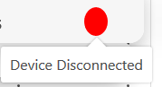

# hciContactsManager
Example of Contacts Manager built with Apache Cordova following Human Computer Interaction principles.

See [How it's is done](../How it's done.md) for details on the architecture

See [installation guide](Installation Guide.md) 

See [Demo](http://hcicontactsmanager2017.altervista.org/) hosted on Altervista for test the web application.

## Main features ##

<table>
    <tr>
        <td><b>Visualization of all contacts</b></td><td>The interface shows all the contacts in your phone. You can order them by some filter</td><td></td>
    </tr>
    <tr>
        <td rowspan="2"><b> Single-contact visualization</td><td>You can see the single contact's details</td><td></td>
    </tr>
    <tr><td>Here you can delete the user</td><td></td></tr>
    <tr>
        <td><b>Insertion of new contact</b></td><td>From the top bar, you can add a contact to your phone</td><td></td>
    </tr>
    <tr>
        <td rowspan="2"><b>Contact persistence</b></td><td>You can save (in the cookies) the current session (manteining th contact list) by clicking in the floppy icon in the top bar</td><td></td>
    </tr>
    <tr><td>Then you can restore the session when you refresh the page. You can also reconnect the device (see Notes)</td><td></td></tr>
    <tr>
</table>

## Extra features ##

<table>
    <tr>
        <td><b>Contact tagging and tag search</b></td><td>You can add tags to your contacts, linking them to the current session. You can also looking for contact with a certaing tag in the search box</td><td></td>
    </tr>
    <tr>
        <td><b>Contact editing*</b></td><td>You can edit contact's fields</td><td></td>
    </tr>
    <tr>
        <td><b> Full-text search</b></td><td>You can search a contact writing a string contained in any of his fields, including TAGs.</td><td></td>
    </tr>
    <tr>
        <td><b>Dynamic persistence</b></td><td>You can make an operation in the contacts database (creating, editing, deleting..) even if your device is disconnected. When you re-connect the device, the operation will done. </td><td></td>
    </tr>
    <tr>
        <td><b>Sending SMS</b></td><td>You can also send a sms to a contact! </td><td></td>
    </tr>
</table>

*User editing is not dirrectly supported by Cordova, so you can only change existing fields and no creating new fields. 

### Notes ###
1. You can connect the device simply scanning the QR Code appairing when you open the web site
2. Direct CRUD operations of a contacts needs the device to be connected
3. You can re-connect a device (restoring a session) by insert the number of the session (the number on top-right of the page) in the app ("Insert the session id").
4. If you close the app not clicking the android back button, the website will continue to think that app is connected!
